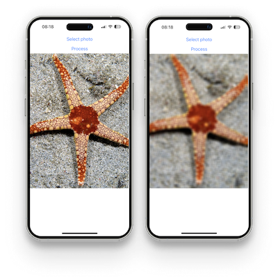
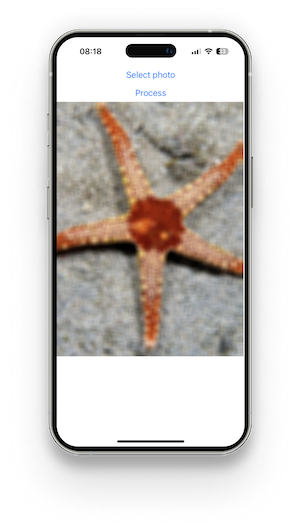

# Blur image on separated thread

In this example, it will show a way to muddle a photo from a photo gallery using another thread and the WorkletsCore library.



### Requirements

- We must have the react-native-fast-opencv and react-native-worklets-core libraries installed.
- We have a way to handle image from gallery and get it in Base64 format. For this purpose, I used the [react-native-image-picker](https://github.com/react-native-image-picker/react-native-image-picker) library.

### Code

Let's start with a simple code that allows us to select an image from the gallery in Base64 format.

```js
import { useState } from 'react';
import { Button, SafeAreaView, Text } from 'react-native';
import { launchImageLibrary, type Asset } from 'react-native-image-picker';

export function ImageExample() {
  const [photo, setPhoto] = useState<Asset | null>(null);

  const getImageFromGallery = async () => {
    const result = await launchImageLibrary({
      mediaType: 'photo',
      includeBase64: true,
    });
    setPhoto(result.assets?.at(0) || null);
  };

  return (
    <SafeAreaView style={{ backgroundColor: 'white', flex: 1 }}>
      <Button title="Select photo" onPress={getImageFromGallery} />
      <Button title="Process" onPress={() => null} />
    </SafeAreaView>
  );
}
```

The next step will be to create a function to save the result on the JS thread when the job is done.

```js
const [result, setResult] = useState<string>('');

const setImage = useRunOnJS((data: string) => {
  setResult(data);
}, []);
```

Now we will create code that will allow us to perform an action on another thread:

```js
const worklet = useWorklet('default', () => {
  'worklet';
  if (photo?.base64) {
    // ...
  }
});
```

Our goal is to apply a simple blur operation using the `blur` function. Then we convert the value to Base64 and display the image.

```js
const src = OpenCV.base64ToMat(photo.base64);
const dst = OpenCV.createObject(ObjectType.Mat, 0, 0, DataTypes.CV_8U);
const kernel = OpenCV.createObject(ObjectType.Size, 1, 1);
const point = OpenCV.createObject(ObjectType.Point, 0, 0);

OpenCV.invoke(
  'blur',
  src,
  dst,
  kernel,
  point,
  BorderTypes.BORDER_DEFAULT
);
const dstResult = OpenCV.toJSValue(dst);

setImage(dstResult.base64);
```

**IMPORTANT.** Remember to remove objects from the memory buffer at the end.

```js
OpenCV.clearBuffers(); // REMEMBER TO CLEAN
```

And ready we can now blur the photo.

