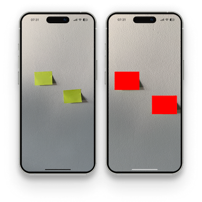

# Real-time detection

In this example, I show how to use the Fast OpenCV library together with the Vision Camera library's frame processor. Our goal will be to detect a coloured object and mark it on the screen. 



### Requirements

- We must have the react-native-fast-opencv library installed.
- VisionCamera together with WorkletsCore to handle the frame processors must be installed. Detailed instructions are available [here](https://react-native-vision-camera.com/docs/guides/frame-processors).
- Installed [vision-camera-resize-plugin](https://github.com/mrousavy/vision-camera-resize-plugin) library to perform efficient frame scaling.
- Installed [react-native-skia](https://github.com/Shopify/react-native-skia) for drawing elements on frames.

### Code

We will start by constructing the base. Our component will have a VisionCamera component used and a frame processor constructed using Skia.

```js
import { PaintStyle, Skia } from '@shopify/react-native-skia';
import { useEffect } from 'react';
import { StyleSheet, Text } from 'react-native';
import {
  Camera,
  useCameraDevice,
  useCameraPermission,
  useSkiaFrameProcessor,
} from 'react-native-vision-camera';
import { useResizePlugin } from 'vision-camera-resize-plugin';

const paint = Skia.Paint();
paint.setStyle(PaintStyle.Fill);
paint.setColor(Skia.Color('lime'));

export function VisionCameraExample() {
  const device = useCameraDevice('back');
  const { hasPermission, requestPermission } = useCameraPermission();

  const { resize } = useResizePlugin();

  useEffect(() => {
    requestPermission();
  }, [requestPermission]);

  const frameProcessor = useSkiaFrameProcessor((frame) => {
    'worklet';

    const height = frame.height / 4;
    const width = frame.width / 4;

    const resized = resize(frame, {
      scale: {
        width: width,
        height: height,
      },
      pixelFormat: 'bgr',
      dataType: 'uint8',
    });

  }, []);

  if (!hasPermission) {
    return <Text>No permission</Text>;
  }

  if (device == null) {
    return <Text>No device</Text>;
  }

  return (
    <Camera
      style={StyleSheet.absoluteFill}
      device={device}
      isActive={true}
      frameProcessor={frameProcessor}
    />
  );
}
```

We scale the frame to reduce its size and enable faster processing. In addition, we handle permissions for the Camera.

Now let's focus on the function of our frameProcessor. Our aim will be to detect a bright green object (card) and mark it on the screen in real time.

To do this, let us add a new Mat object.

```js
const src = OpenCV.frameBufferToMat(height, width, resized);
```

And another object that will contain our processed image.

```js
const dst = OpenCV.createObject(ObjectType.Mat, 0, 0, DataTypes.CV_8U);
```

In order to find the object easily, it will be necessary to change the colour to HSV. We can also create objects (Scalar) that will be the beginning of our detected range and its end. The `cvtColor` function changes the colour format, while the `inRange` function leaves only those pixels whose colour fits within the specified range.

```js
const lowerBound = OpenCV.createObject(ObjectType.Scalar, 30, 60, 60);
const upperBound = OpenCV.createObject(ObjectType.Scalar, 50, 255, 255);
OpenCV.invoke('cvtColor', src, dst, ColorConversionCodes.COLOR_BGR2HSV);
OpenCV.invoke('inRange', dst, lowerBound, upperBound, dst);
```

We further split the image into channels and extract the first channel.

```js
const channels = OpenCV.createObject(ObjectType.MatVector);
OpenCV.invoke('split', dst, channels);
const grayChannel = OpenCV.copyObjectFromVector(channels, 0);
```

Now we will deal with finding the contours in order to do this we will use the `findContours` function. 

```js
const contours = OpenCV.createObject(ObjectType.MatVector);
OpenCV.invoke(
  'findContours',
  grayChannel,
  contours,
  RetrievalModes.RETR_TREE,
  ContourApproximationModes.CHAIN_APPROX_SIMPLE
);
```

Our detected card must be quite large to be detected. We therefore filter out those objects that are too small. To do this, we use the `contourArea` function to take the size of the contour and then, if it is larger than a fixed value, find a rectangle that will be able to cover it (`boundingRect` function).

```js
for (let i = 0; i < contoursMats.array.length; i++) {
  const contour = OpenCV.copyObjectFromVector(contours, i);
  const { value: area } = OpenCV.invoke('contourArea', contour, false);

  if (area > 3000) {
    const rect = OpenCV.invoke('boundingRect', contour);
    rectangles.push(rect);
  }
}
```

We can mark the elements detected in this way using Skia.

```js
frame.render();

for (const rect of rectangles) {
  const rectangle = OpenCV.toJSValue(rect);

  frame.drawRect(
    {
      height: rectangle.height * 4,
      width: rectangle.width * 4,
      x: rectangle.x * 4,
      y: rectangle.y * 4,
    },
    paint
  );
}
```

**IMPORTANT.** Remember to remove objects from the memory buffer at the end. Lack of this step, will result in continuous holding of values in memory - and consequently, in the case of frame processors, very fast filling of memory.

```js
OpenCV.clearBuffers(); // REMEMBER TO CLEAN
```

Our finished frame processor looks as follows:

```js
const frameProcessor = useSkiaFrameProcessor((frame) => {
  'worklet';

  const height = frame.height / 4;
  const width = frame.width / 4;

  const resized = resize(frame, {
    scale: {
      width: width,
      height: height,
    },
    pixelFormat: 'bgr',
    dataType: 'uint8',
  });

  const src = OpenCV.frameBufferToMat(height, width, resized);
  const dst = OpenCV.createObject(ObjectType.Mat, 0, 0, DataTypes.CV_8U);

  const lowerBound = OpenCV.createObject(ObjectType.Scalar, 30, 60, 60);
  const upperBound = OpenCV.createObject(ObjectType.Scalar, 50, 255, 255);
  OpenCV.invoke('cvtColor', src, dst, ColorConversionCodes.COLOR_BGR2HSV);
  OpenCV.invoke('inRange', dst, lowerBound, upperBound, dst);

  const channels = OpenCV.createObject(ObjectType.MatVector);
  OpenCV.invoke('split', dst, channels);
  const grayChannel = OpenCV.copyObjectFromVector(channels, 0);

  const contours = OpenCV.createObject(ObjectType.MatVector);
  OpenCV.invoke(
    'findContours',
    grayChannel,
    contours,
    RetrievalModes.RETR_TREE,
    ContourApproximationModes.CHAIN_APPROX_SIMPLE
  );

  const contoursMats = OpenCV.toJSValue(contours);
  const rectangles: Rect[] = [];

  for (let i = 0; i < contoursMats.array.length; i++) {
    const contour = OpenCV.copyObjectFromVector(contours, i);
    const { value: area } = OpenCV.invoke('contourArea', contour, false);

    if (area > 3000) {
      const rect = OpenCV.invoke('boundingRect', contour);
      rectangles.push(rect);
    }
  }

  frame.render();

  for (const rect of rectangles) {
    const rectangle = OpenCV.toJSValue(rect);

    frame.drawRect(
      {
        height: rectangle.height * 4,
        width: rectangle.width * 4,
        x: rectangle.x * 4,
        y: rectangle.y * 4,
      },
      paint
    );
  }

  OpenCV.clearBuffers(); // REMEMBER TO CLEAN
}, []);
```

### Result

Cards are detected in real time when they are close enough to the lens.

